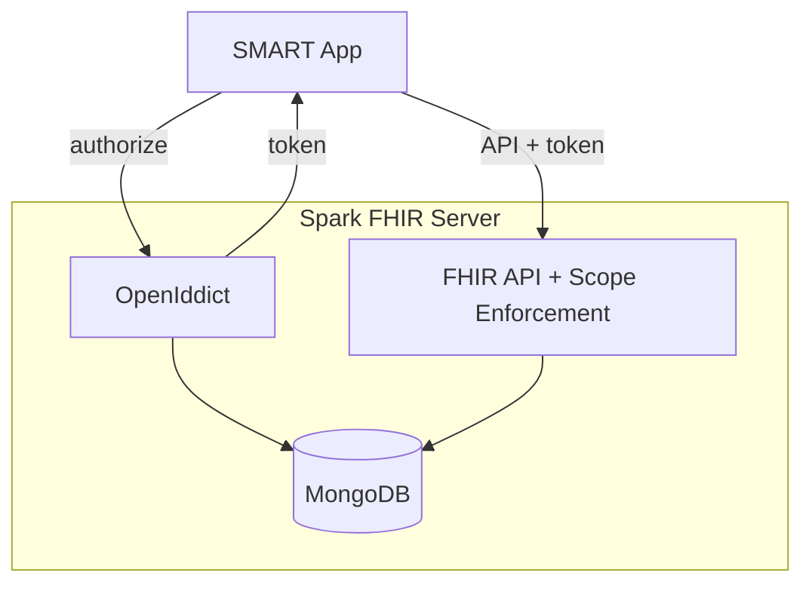

# ADR-0003: SMART on FHIR Authorization Infrastructure

## Status
Draft

## Context
Spark FHIR Server currently lacks SMART on FHIR support, the industry standard for third-party apps connecting to FHIR servers. This limits Spark's use in environments requiring:

- Secure access from client applications
- EHR-integrated app launching (SMART App Launch)
- Fine-grained access control (patient/user/system scopes)
- Patient context sharing between EHR and apps

To enable SMART on FHIR / SMART App Launch, we need to implement OAuth 2.0/OpenID Connect authorization infrastructure.

## Discussion

### Alternatives Considered

1. **External identity provider only (e.g., Auth0, Azure AD)**
   - Pros: No auth code to maintain, turnkey solution
   - Cons: Cannot customize for SMART-specific flows, external dependency, not open source friendly

2. **IdentityServer**
   - Pros: Feature-rich, well-documented
   - Cons: Commercial license required for revenue > $1M, complex setup

3. **OpenIddict (chosen)**
   - Pros: Open source, MongoDB support, extensible, ASP.NET Core native
   - Cons: Less turnkey than commercial alternatives

4. **Custom OAuth implementation**
   - Pros: Full control
   - Cons: Security risk, huge project, maintenance burden, 

### Why OpenIddict?
OpenIddict provides the best balance of flexibility, cost, and maintainability for an open-source project. Key advantages:
- Mature, battle-tested library
- First-class MongoDB support (`OpenIddict.MongoDb`)
- Full OAuth 2.0/OIDC compliance
- Seamless ASP.NET Core integration
- Extensible for SMART-specific requirements

## Decision
We will establish OAuth 2.0/OpenID Connect infrastructure using **OpenIddict**, implemented in phases toward full SMART on FHIR support.

### Target Architecture

### Implementation Phases

**Phase 1 - Auth Foundation:**
- OpenIddict integration with MongoDB
- Basic token issuance and validation
- Client registration

**Phase 2 - SMART-Specific:**
- `.well-known/smart-configuration` endpoint
- SMART scope handling (`patient/*.read`)
- Launch context and patient compartment
- CapabilityStatement SMART extensions

## Consequences

### Positive
- Enables SMART App Launch for third-party apps
- Reusable auth infrastructure for other use cases
- Industry standards compliance (OAuth 2.0, OIDC, SMART)

### Negative
- Increased codebase complexity
- New dependency (OpenIddict)
- Requires certificate management in production

### Risks
- SMART on FHIR specification may evolve
  - Mitigation: OpenIddict is extensible
- Security vulnerabilities in auth code
  - Mitigation: Rely on OpenIddict's proven implementation

## References
- [SMART App Launch IG](http://hl7.org/fhir/smart-app-launch/)
- [OpenIddict](https://github.com/openiddict/openiddict-core)
- [OpenIddict MongoDB](https://www.nuget.org/packages/OpenIddict.MongoDb)