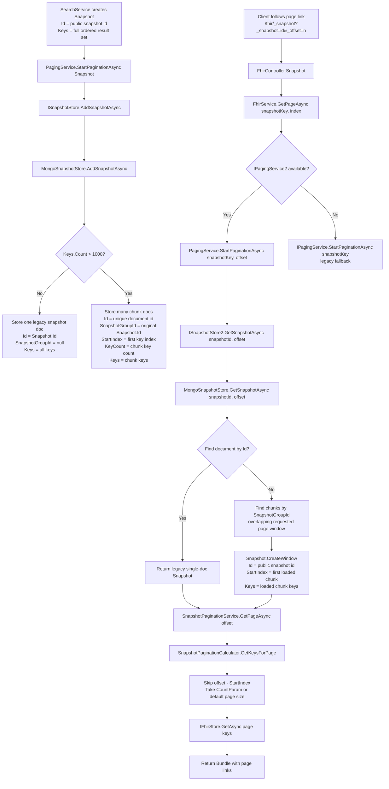

# Chunked Snapshot Storage Code Diagram



## Storage Shape

```text
Public page token:
_snapshot = original Snapshot.Id

Mongo chunk documents:
Id              = unique Mongo document id
SnapshotGroupId = original Snapshot.Id
StartIndex      = global offset of first key in this chunk
KeyCount        = number of keys in this chunk
Keys            = only this chunk's keys
```
